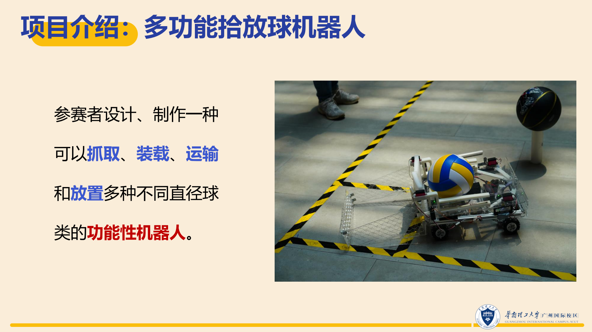
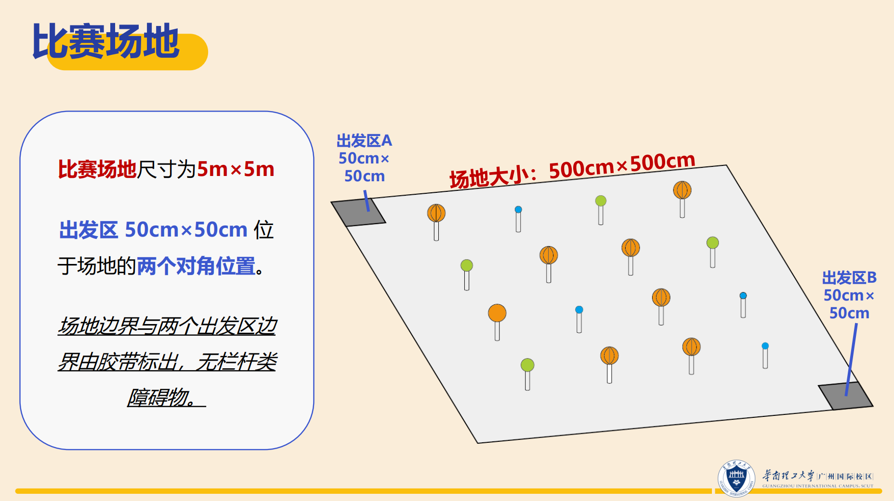
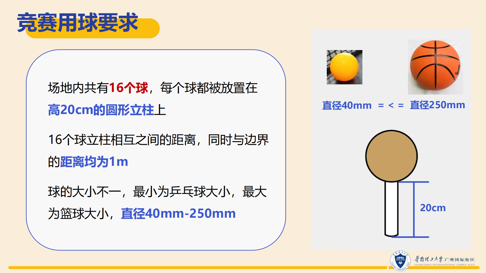

# Multi-Functional Ball Retrieval Robot: 多功能拾球机器人

## 背景
在日常生活中，人们经常面临着需要捡拾、搬运各种大小不一的球类物品的情况，例如体育场馆、儿童游乐场等场所。然而，传统的人工捡拾方式效率低下，且易受到人力、时间和环境等因素的限制。开发一款多功能拾球机器人能够有效地解决这一问题。

多功能拾球机器人需要准确感知周围环境，并具备智能化的决策能力。它们可以灵活适应不同直径、材质的球类，并能够快速、装载和运输这些球类物品。无论是在体育比赛现场、儿童游乐场还是家庭庭院，多功能拾球机器人都能够发挥重要作用，为人们提供便利的服务。

与传统的人工捡拾方式相比，多功能拾球机器人具有以下优势：
1. 提高了捡拾效率：机器人能够快速、精准地完成捡拾任务，大大节省了人力和时间成本。
2. 适应性强：机器人可以适应不同直径、材质的球类，且在各种复杂环境下都能够正常工作。

因此，开发一款多功能拾球机器人有望为人们的生活带来便利，并成为未来智能化生活的重要组成部分。

## 赛题背景

## 简介

项目可以分为三部分：
1. 机器人结构加工
2. 机器人电路设计
3. 机器人控制系统

### 机器人结构加工
- 设计驱动机器人快速、灵活地全向运动的底盘。
- 利用小球的惯性通过撞击立柱的方式拾球。
- 设计球框以限制小球在放置区内的移动，实现放球任务。

### 机器人电路设计
- 电路设计部分

### 机器人控制系统
- 使用Jeston Nano作为中控，融合多种控制方式实现对机器人的控制。
- 使用Python与C++混合编程控制机器人完成任务。

中文详细复现流程保存在了*zh*文件夹中，您可以前往[机器人结构加工](./zh/robot_structure/summary.md)、[机器人电路设计](./zh/robot_circuit/summary.md)以及[机器人控制系统](./zh/robot_control/summary.md)进行查阅。

## 项目团队

团队成员：满书全、麦皓文、蒋明宇、尘雨泽、曾子渊

学校：华南理工大学
